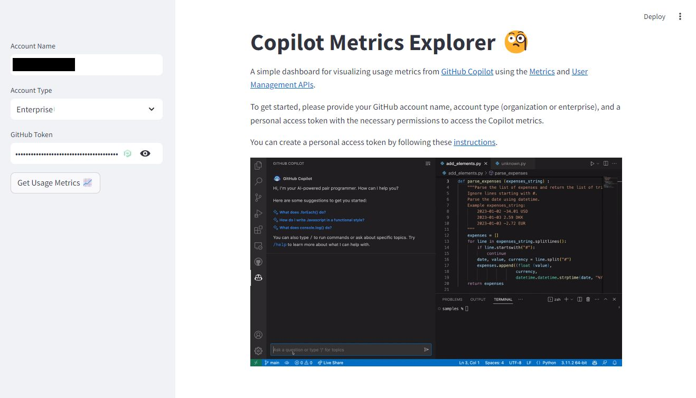

# Copilot Micro Dashboard 🧐

A simple dashboard for visualizing usage metrics from GitHub Copilot using the [Metrics](https://docs.github.com/en/rest/copilot/copilot-metrics) and [User Management APIs](https://docs.github.com/en/rest/copilot/copilot-user-management).

> **Warning**☝ This project was just a simple exercise to get acquainted with the REST API for Copilot metrics. For an extended, `𝚙𝚛𝚘𝚍`-ready version, check out Microsoft's [GitHub Copilot Metrics Dashboard](https://github.com/microsoft/copilot-metrics-dashboard).

## Getting Started

1. Install dependencies

    > pip install -r requirements.txt

2. Start the application

    > streamlit run app.py
